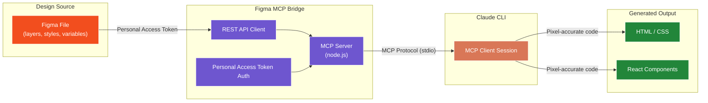
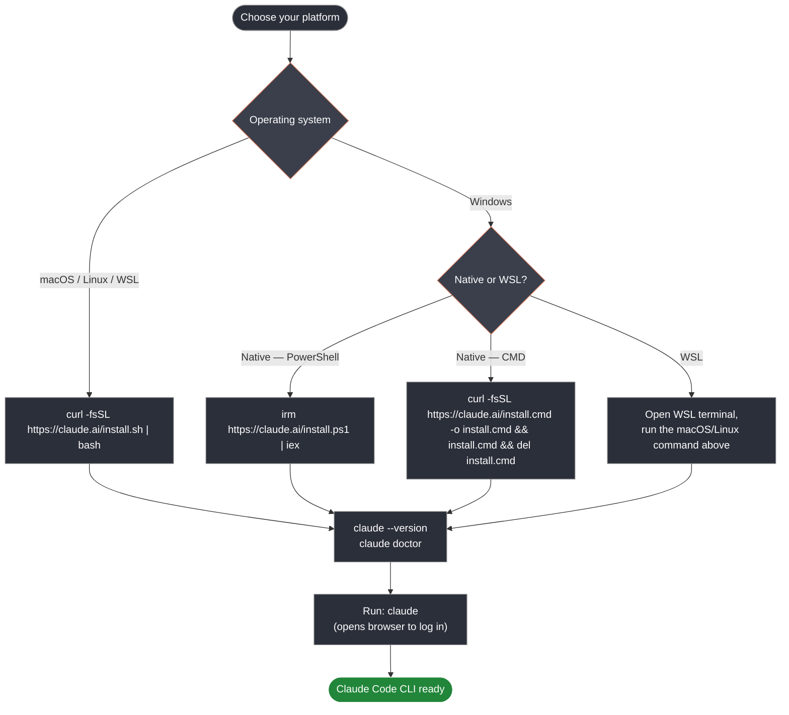
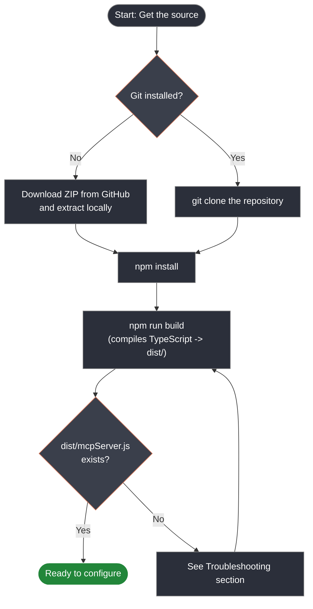
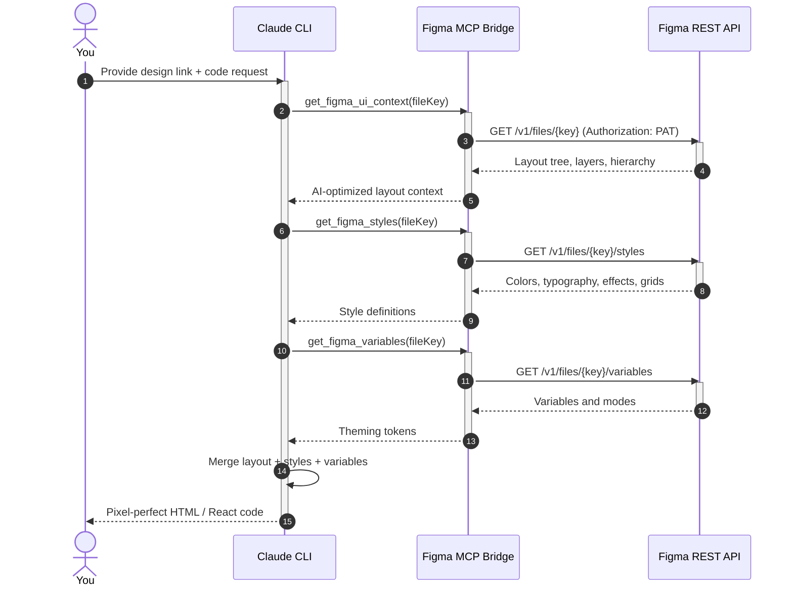
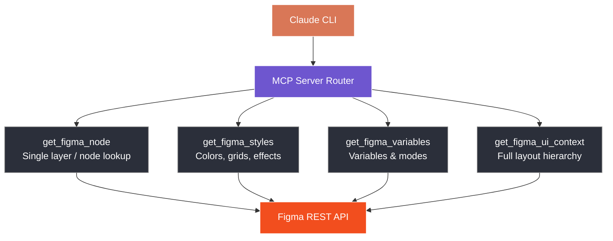

<div align="center">

# Figma MCP Bridge

**Connect Claude directly to your Figma designs — no manual CSS copying, no channel codes.**

[](#prerequisites)
[](#)
[](#configuration-personal-access-token)
[](#)

</div>

---

## Overview

The Figma MCP Bridge gives Claude live, structured access to your design data — layers, styles, and variables — through the Model Context Protocol. Instead of guessing layout and color values from a screenshot, Claude reads the actual design tree and produces code that matches it exactly.



---

## Table of Contents

| Section |
|---|
| [Prerequisites](#prerequisites) |
| [Installing the Claude Code CLI](#installing-the-claude-code-cli) |
| [Installation](#installation) |
| [Configuration: Personal Access Token](#configuration-personal-access-token) |
| [Step 1 — Connect to Claude CLI](#step-1--connect-to-claude-cli) |
| [Step 2 — Verify the MCP Is Connected](#step-2--verify-the-mcp-is-connected) |
| [Step 3 — Generate Pixel-Perfect Code](#step-3--generate-pixel-perfect-code-from-a-design) |
| [Tools Reference](#tools-reference) |
| [Troubleshooting](#troubleshooting) |

---

## Prerequisites

| Requirement | Notes |
|---|---|
| **Node.js** | v18.0.0 or higher (required to build this bridge) |
| **Figma account** | Used to generate a Personal Access Token |
| **Claude Code CLI** | Installed and working — see [Installing the Claude Code CLI](#installing-the-claude-code-cli) below |
| **Git** | Optional — only needed for the clone method below |

---

## Installing the Claude Code CLI

Claude Code is Anthropic's terminal-based agent and is the client this bridge plugs into. It runs on macOS 13+, Windows 10 1809+ / Windows Server 2019+, Ubuntu 20.04+, Debian 10+, and Alpine Linux 3.19+, on 4 GB+ RAM, x64 or ARM64 hardware, with an internet connection. Pick the install path for your platform below, then verify the install before moving on to the bridge itself.



**macOS, Linux, and WSL — native installer (recommended):**

```bash
curl -fsSL https://claude.ai/install.sh | bash
```

**Windows — native, PowerShell (no Administrator required):**

```powershell
irm https://claude.ai/install.ps1 | iex
```

**Windows — native, CMD:**

```batch
curl -fsSL https://claude.ai/install.cmd -o install.cmd && install.cmd && del install.cmd
```

If `irm` isn't recognized, you're in CMD, not PowerShell. If `&&` throws a syntax error, you're in PowerShell, not CMD. Your prompt shows `PS C:\>` in PowerShell and plain `C:\>` in CMD.

**Windows — WSL:** open your WSL distribution and run the macOS/Linux command above from inside it, not from PowerShell or CMD.

> [Git for Windows](https://git-scm.com/downloads/win) is recommended on native Windows so Claude Code can use its Bash tool. Without it, Claude Code falls back to the PowerShell tool. WSL installs don't need it.

**Alternative install methods:**

| Method | Command | Notes |
|---|---|---|
| Homebrew | `brew install --cask claude-code` | Does not auto-update; run `brew upgrade claude-code` |
| WinGet | `winget install Anthropic.ClaudeCode` | Does not auto-update; run `winget upgrade Anthropic.ClaudeCode` |
| npm (all OSes) | `npm install -g @anthropic-ai/claude-code` | Requires Node.js 22+; avoid `sudo npm install -g` |
| apt / dnf / apk | Signed Anthropic repositories | See the [official setup docs](https://code.claude.com/docs/en/setup) for repo configuration |

**Verify and authenticate:**

```bash
claude --version
claude doctor
claude
```

`claude doctor` prints installation and settings diagnostics. Running `claude` opens a browser prompt to log in with a Claude Pro, Max, Team, Enterprise, or Console account (the free Claude.ai plan doesn't include Claude Code access). If `ANTHROPIC_API_KEY` is set in your environment, Claude Code asks you to approve that key instead of opening a browser.

For full platform-by-platform detail, version pinning, and uninstall steps, see the [official Claude Code setup documentation](https://code.claude.com/docs/en/setup).

---

## Installation



**Option A — Download the ZIP (no git required)**

1. Go to `https://github.com/bhargav-mistry/Fig_MCP`.
2. Click **Code → Download ZIP**.
3. Extract the ZIP to a folder of your choice.
4. Open a terminal in that folder.

**Option B — Clone with git**

```bash
git clone https://github.com/bhargav-mistry/Fig_MCP.git
cd Fig_MCP
```

**Then, either way, build from the project root:**

```bash
npm install
npm run build
```

This compiles the TypeScript source into the `dist` folder, which is what Claude CLI will run.

---

## Configuration: Personal Access Token

This server connects directly to the Figma REST API using a personal access token. No plugin, no Bridge Mode, no channel code required.

**Step 1 — Generate a Personal Access Token**

1. Open Figma → **Settings**
2. Select the **Personal Access Tokens** tab
3. Generate a new token and copy it immediately — it is only shown once

**Step 2 — Add the token to your environment**

Open `server/.env` (create it if it doesn't exist) and add:

```
FIGMA_PAT=your_token_here
```

Replace `your_token_here` with the token you copied.

---

## Step 1 — Connect to Claude CLI

Locate or create the Claude CLI configuration file at `~/.claude/config.json`, and register the server under `mcpServers`. Use the **absolute path** to your project folder.

```json
{
  "mcpServers": {
    "figma-mcp": {
      "command": "node",
      "args": ["/absolute/path/to/Fig_MCP/server/dist/mcpServer.js"]
    }
  }
}
```

Save the file. Claude CLI manages the server process automatically — nothing to start manually. It becomes available the next time you run a `claude` session.

> If you had a manual `npm run dev` process running in a terminal for testing, stop it (`Ctrl+C`) before starting `claude` — it can hold the same port and block the managed process.

---

## Step 2 — Verify the MCP Is Connected

Start a Claude CLI session and ask:

```
Which MCP servers are currently connected?
```

Claude lists the active MCP connections.

| Response | Meaning |
|---|---|
| `figma-mcp` appears in the list | You're all set — go to Step 3 |
| `figma-mcp` is missing | Recheck the path in `config.json`, then restart the CLI session |

---

## Step 3 — Generate Pixel-Perfect Code from a Design



Once `figma-mcp` is confirmed connected, give Claude a prompt with your Figma file or frame link and describe the output you want.

**For React:**

```
Read https://www.figma.com/file/XYZ123/My-Design and generate
pixel-perfect React code for this screen, matching spacing,
typography, and colors exactly.
```

**For plain HTML/CSS:**

```
Read https://www.figma.com/file/XYZ123/My-Design and generate
a pixel-perfect HTML and CSS implementation of this component.
```

Claude pulls the design data (layout, styles, variables) via the MCP tools below and produces matching code.

---

## Tools Reference

| Tool | Description |
|---|---|
| `get_figma_node` | Reads a specific layer by node ID or Figma URL |
| `get_figma_styles` | Exports color styles, grids, and effects from the file |
| `get_figma_variables` | Exports Figma Variables and Modes, useful for theming workflows |
| `get_figma_ui_context` | Returns an AI-optimized layout hierarchy of the current file |



---

## Troubleshooting

<details>
<summary><strong>Windows — "npm.ps1 cannot be loaded because running scripts is disabled on this system"</strong></summary>

This is a PowerShell execution policy restriction. Run PowerShell **as Administrator** and execute:

```powershell
Set-ExecutionPolicy -ExecutionPolicy RemoteSigned -Scope CurrentUser
```

Or, for a single session only:

```powershell
Set-ExecutionPolicy -ExecutionPolicy Bypass -Scope Process
```

Close and reopen PowerShell, then retry your original command.

</details>

<details>
<summary><strong>macOS / Linux — "Permission denied" when running the server or build script</strong></summary>

From the project root, run:

```bash
chmod -R 755 ~/path/to/Fig_MCP
chmod +x server/dist/mcpServer.js
```

Replace the path with wherever you placed the project.

</details>

<details>
<summary><strong>"Cannot find module 'figma-mcp-shared'" / TS2307 errors</strong></summary>

This happens if `npm run build` was run from inside `server/` instead of the project root. Go back to the root and rebuild:

```bash
cd ..
npm install
npm run build
```

If it persists, clear the cache and rebuild:

```bash
npm run clean
npm run build
```

</details>

<details>
<summary><strong>Claude CLI doesn't show <code>figma-mcp</code> as connected</strong></summary>

1. Confirm the path in `~/.claude/config.json` is an **absolute path** and matches your project location.
2. Confirm `npm run build` completed without errors and `server/dist/mcpServer.js` exists.
3. Confirm `FIGMA_PAT` is set in `server/.env`.
4. Restart the `claude` CLI session and ask again which MCP servers are connected.

</details>

---

<div align="center">

Pixel Perfect. Developer Ready.

</div>
